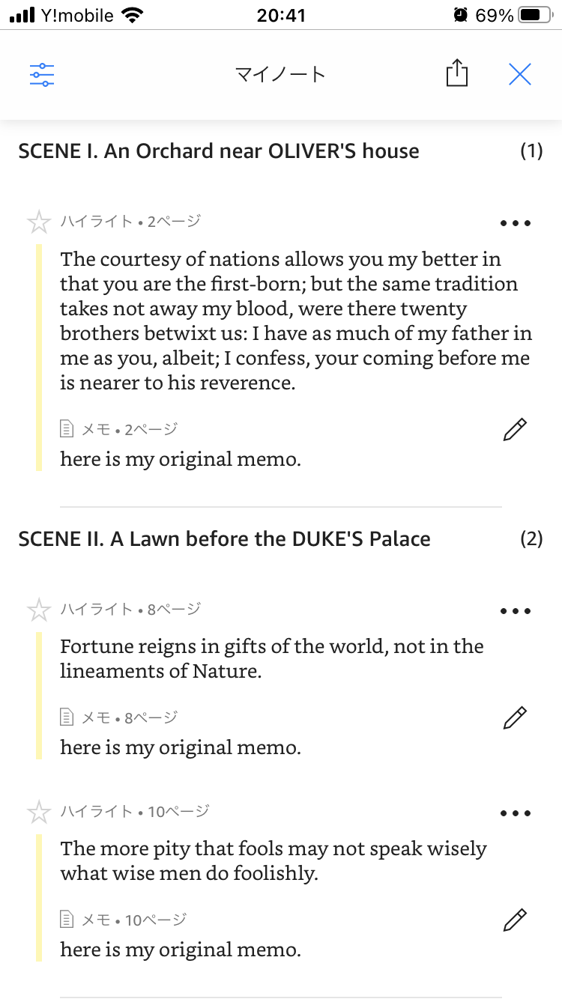

# import-kindle-notebook-to-notion
A tool for importing kindle notebooks into notion.

## Development environment
* kindle
  * iOS: 6.43
  * Amazon Fire: 14.43.100(1.3.243053.0)
* notion API beta
  * 2021-05-13
* PHP
  * 7.3.24
* curl
  * 7.64.1

## Install

1. Create install folder and move into that.

2. Clone the code.
<pre>
git clone https://github.com/happy-se-life/import-kindle-notebook-to-notion.git
</pre>

## Preparation

1. Create Reading list page. See screenshot. 

2. Edit config.php, set API token and database ID. 
* ref. https://developers.notion.com/docs

3. Share a database with your integration. 
* ref. https://developers.notion.com/docs

## How to use

1. Read book using kindle app and make notebook.  

2. Export notebook as html. Save html to above folder.

3. Run this tool.
<pre>
php import-kindle-notebook-to-notion.php notebook.html
</pre>

## Screenshot after import

1. Database  

2. Individual page  

## License
* MIT Lisense

## Notes
* Personal use only.